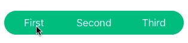

# GMSegmentedControl

* Customization
* Swipeable
* Nullable (Able to deselect segment)



## Usage

```objective-c
  NSArray *segments = @[@"First", @"Second", @"Third"];
  
  GMSegmentedControl *segmentedControl = [[GMSegmentedControl alloc] initWithSegments:segments];
  segmentedControl.frame = CGRectMake(0, 0, 300, 40);
  segmentedControl.center = self.view.center;
  segmentedControl.cornerType = GMSegmentedControlCornerTypePill;
  segmentedControl.backgroundColor = [UIColor greenColor];
  segmentedControl.borderColor = [UIColor greenColor];
  segmentedControl.tintColor = [UIColor whiteColor];
  [segmentedControl addTarget:self
                       action:@selector(segmentedControlValueChanged:)
             forControlEvents:UIControlEventValueChanged];

  [self.view addSubview:segmentedControl];
```

## Default settings

```objective-c
  self.clipsToBounds = YES;
  self.selectedSegmentIndex = NSNotFound;
  self.cornerType = GMSegmentedControlCornerType_default;
  self.backgroundColor = [UIColor clearColor];
  self.tintColor = [UIColor greenColor];
  self.animationDuration = 0.1;
  self.selectedItemTextColor = [UIColor darkGrayColor];
```

## Corner radius

```objective-c
typedef NS_ENUM(NSInteger, GMSegmentedControlCornerType) {
  GMSegmentedControlCornerTypeDefault,    // cornerRadius = 0
  GMSegmentedControlCornerTypeRounded1,   // cornerRadius = 4
  GMSegmentedControlCornerTypeRounded2,   // cornerRadius = 8
  GMSegmentedControlCornerTypePill,       // cornerRadius = half height
};
```